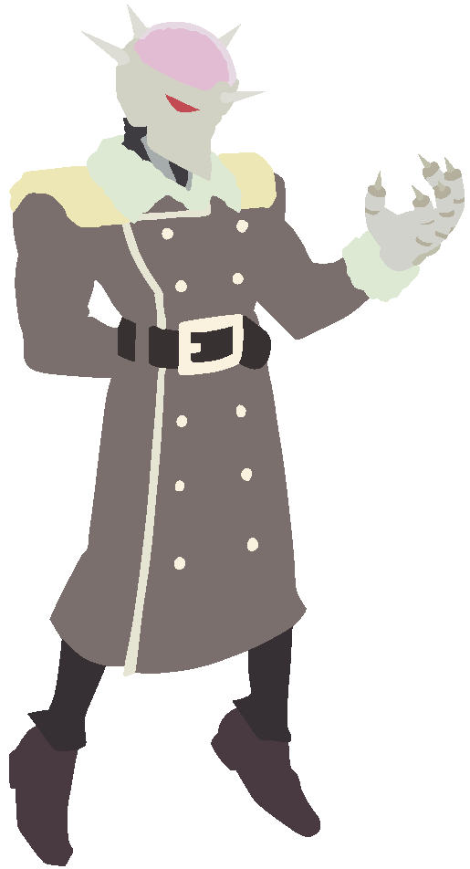

# Submissions

> The [original submissions page](https://forum.skullgirlsmobile.com/threads/17533) was created on May 8, 2021, and vanished on November 11, 2024.

## How to Create a Custom Palette File

1. Choose a raw image `<NAME>_raw.png`.
2. Using the raw image, create the linework layer `<NAME>_line.png`.
   - Soft edges are allowed.
     - If tracing, use the brush tool.
     - If using selections, turn on anti-aliasing.
   - The script only reads the alpha channel here; it does not use any color information.
3. Using the raw image, create the base colors layer `<NAME>_base.png`.
   - Hard edges are recommended.
     - Use the pencil tool instead of the brush.
     - For other tools, turn off anti-aliasing and feathering.
4. Using the base colors layer, create the color areas layer `<NAME>_area.png`.
   - Hard edges are required.
     - 
     - Ignoring this rule will result in unwanted colormap areas, which can also cause other issues like color ID overflow.
   - Different items/materials/areas should be different colors.
   - If colors match in this colormap, they will match forever.
     - For example, if the hat and the skin are both colored `#A1B2C3` in your `area.png` submission, then the hat will always be skin-colored in the Palette Editor no matter what.
   - If you're picky about color IDs, encode them in the red channel.
     - To match official colormaps, reference the Palette Editor. Click on a sprite and you'll see the corresponding color ID as a circled number in the sidebar.

## How to Submit

- Recipient: [krazete@gmail.com](mailto:krazete@gmail.com?subject=%5Bsgmpalette%5D)
- Subject: [sgmpalette]
- Body: Attach the 4 layers: `<NAME>_raw.png`, `<NAME>_line.png`, `<NAME>_base.png`, and `<NAME>_area.png`.
  - Alternatively, instead of `raw` and `base`, you may submit a highlights layer `<NAME>_highlight.png` and a shadows layer `<NAME>_shadow.png`. See the Examples section below.
  - Alternatively2, instead of `raw` and `base` or `highlight` and `shadow`, you may submit a details layer `<NAME>_detail.png`. See the Examples section below.
  - Let me know your username if it isn't apparent. (Custom sprites are sorted into folders by username.)
  - If the art used is not official and is not yours, please credit the artist in your message. Also use this filename format instead: `<NAME>_artist=<ARTIST>_<LAYER>.png`.

I will process your submitted layers with `create_sprite.sh` and upload the result here.

Please be aware that your submission may be denied, revised, or replaced in the future by me or another submitter without notice for the following reasons:
- poor quality
- redundant content
- uncredited art
- improperly named layers
- because

You may also copy or fork this repo, put your layers in a [custom](custom) subfolder, and run `create_sprite.sh` yourself if you want to use a custom sprite without submitting it for public use.

## Examples

All submissions are recorded in the [custom](custom) folder of this repository.

### Normal Submission

|Raw|Line|Base|Area|
|-|-|-|-|
|||||

Most submissions are like this, letting `create_sprite.py` do the work of extracting highlights and shadows from the `raw` and `base` layers.

### Advanced Submission

Click for more details.

|Highlight|Shadow|Line|Area|
|-|-|-|-|
|||||

> This example in particular takes the extra step of encoding the official colormap into the area layer.  
> This isn't necessary; the area layer can be as colorful as the other submission methods if desired.

The `highlight` and `shadow` layers are created by subtracting the `base` layer from the `raw` layer and vice versa respectively.  
Brightness and contrast can then be adjusted as desired to create more pronounced details in the resulting sprite.

### Advanced+ Submission

Click for more details.

|Detail|Line|Area|
|-|-|-|
||||

This method is intended for those who create shadows and highlights from scratch (rather than differencing `raw` and `base` layers).  
If submitting this way, you must use a base gray of `#CCCCCC` or `RGB(204, 204, 240)`.

This method is also useful for sprites with luminous parts since translucency is treated differently.

> E.g. Parasoul's tears, Fukua's orbs, Robo-Fortune's beams, explosions, fire, etc.

Luminous areas have a floor of `#646464` or `RGB(100, 100, 100)`. Anything darker than this will be completely transparent.

The detail layer of Parasoul's official Napalm Trigger sprite demonstrates both the base gray and the luminous floor:

|Palettized Sprite|Red Channel|Green Channel|Blue Channel|
|-|-|-|-|
|||||
|(ignore this)|(ignore this)|(ignore this)|This is the `detail` layer.|

