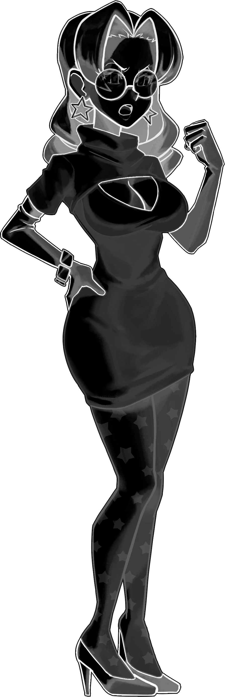

# Submissions

> The [original submissions page](https://forum.skullgirlsmobile.com/threads/17533) was created on May 8, 2021, and vanished on November 11, 2024.

## How to Create a Custom Palette File

1. Choose a raw image `<NAME>_raw.png`.
2. Using the raw image, create the linework layer `<NAME>_line.png`.
   - Soft edges are allowed.
     - If tracing, use the brush tool.
     - If using selections, turn on anti-aliasing.
   - The script only reads the alpha channel here; it does not use any color information.
3. Using the raw image, create the base colors layer `<NAME>_base.png`.
   - Hard edges are required.
     - Use the pencil tool instead of the brush.
     - For other tools, turn off anti-aliasing and feathering.
4. Using the base colors layer, create the color areas layer `<NAME>_area.png`.
   - Hard edges are required.
   - Different items/materials/areas should be different colors.
   - If colors match in this color map, they will match forever.
     - For example, if the hat and the skin are both colored `#A1B2C3` in your `area.png` submission, then the hat will always be skin-colored in the Palette Editor no matter what.
   - If you're picky about color IDs, encode them in the red channel.
     - To match official color maps, reference the Palette Editor. Click on a sprite and you'll see the corresponding color ID as a circled number in the sidebar.

## How to Submit

- Recipient: [krazete@gmail.com](mailto:krazete@gmail.com?subject=%5Bsgmpalette%5D)
- Subject: [sgmpalette]
- Body: Attach the 4 layers: `<NAME>_raw.png`, `<NAME>_line.png`, `<NAME>_base.png`, and `<NAME>_area.png`.
  - Alternatively, instead of `raw.png` and `base.png`, you may submit a highlights layer `<NAME>_highlight.png` and a shadows layer `<NAME>_shadow.png`.
  - Also let me know your username if it isn't apparent. (Custom sprites are sorted into folders by username.)

I will input your submitted layers into `create_sprite.py` and upload the result here.

Please be aware that your submission may be denied, revised, or replaced in the future by me or another submitter without notice, usually for reasons regarding quality or redundancy.

## Examples

All submissions are recorded in the [custom](custom) folder of this repository.

### Normal Submission

|Raw|Line|Base|Area|
|-|-|-|-|
|||||

Most submissions are like this, letting `create_sprite.py` do the work of extracting highlights and shadows from the `raw` and `base` layers.

### Alternative Submission

|Highlight|Shadow|Base|Area|
|-|-|-|-|
|||||

The `highlight` and `shadow` layers are created by subtracting the `base` layer from the `raw` layer and vice versa respectively. Brightness and contrast can then be adjusted as desired to create more pronounced details in the resulting sprite.
