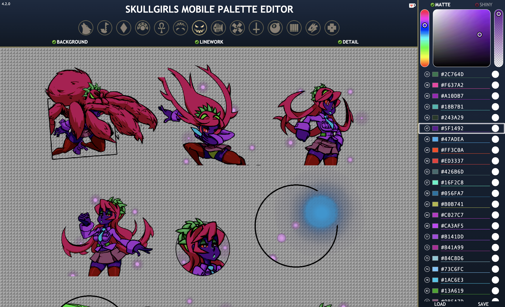

# Skullgirls Mobile Palette Editor

A palette editor for the static sprites of Skullgirls Mobile.

Static sprites consist of portraits, card art, and art for special moves and blockbusters.

A big thanks to Discord user Pupix#0001 for showing me where to find the raw sprites from which this entire project is based on.

Don't expect to be able to perfectly recreate official palettes like Tomb & Gloom or Heart of Darkness. The game uses more complex and more refined blend modes than the ones available here.

## Features

### Menu

To load sprites, you must choose a character from the menu.
You can also toggle visibility of the background layer, linework layer, and detail layer here.

### Spritesheet

The spritesheet contains all in-game static sprites of the chosen character.
You can click within any sprite to select a color area to edit.

The hex color text input will automatically be selected for easy copying via keyboard shortcuts.
(This feature does not activate when a touch is detected instead of a mouse click.)

### Palette

The palette contains all colors present in the chosen character's spritesheet.
Some characters have sprites with noisy edges and thus have extraneous rows of color.

The options at the very top denote how the detail layer is blended with the color layer.

* `Matte` is essentially linear burn.
* I'm not sure what common blend mode `Pastel` resembles, but it uses an arctangent.
* `Shiny` is basically color dodge.
* `Vivid` is linear burn for low values and linear dodge for high values.

A color picker is available above the list of colors.
If your device's native color picker is more feature-rich, you can click the colored boxes at the left of each row to use that instead.
The native color picker will always be focused on the active color row.

The white circles at the right of each row indicate whether that color area is opaque (detail layer applies shadows) or transparent (detail layer is an alpha channel).
This is automatically set based on the selected character, but can be changed.

At the bottom of the palette section, you can load and save palette files.
Palette files are 16x16px images, though you may load images with different dimensions.

## Download

To download a single sprite, right-click (or control-click) a sprite and select `Save Image As...`.
For mobile devices, you can enable the `Download on Tap` button at the bottom of the page and tap on whichever sprite you want to download.

To download a zipped folder of all sprites in the current spritesheet, click the `Download ZIP` button at the bottom.

Thanks to the following:

* [jaames/iro.js](https://github.com/jaames/iro.js) for the color picker
* [Stuk/jszip](https://github.com/Stuk/jszip) for making it easy to create zip files
* [eligrey/FileSaver.js](https://github.com/eligrey/FileSaver.js) for making it easy to download those zip files

The card art sprites can be uploaded to the [SGM Card Creator](https://github.com/Krazete/sgmcard), which should detect it based on its dimensions and automatically set the optimal position parameters.
